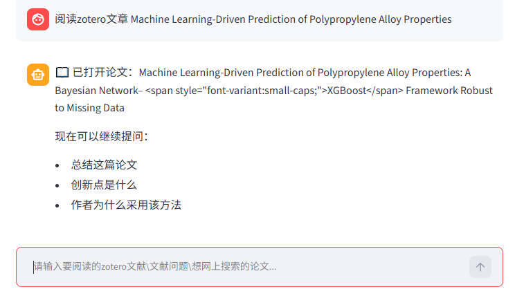
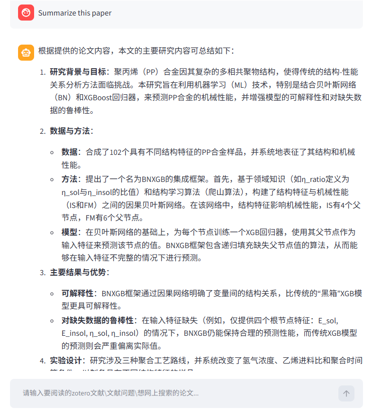
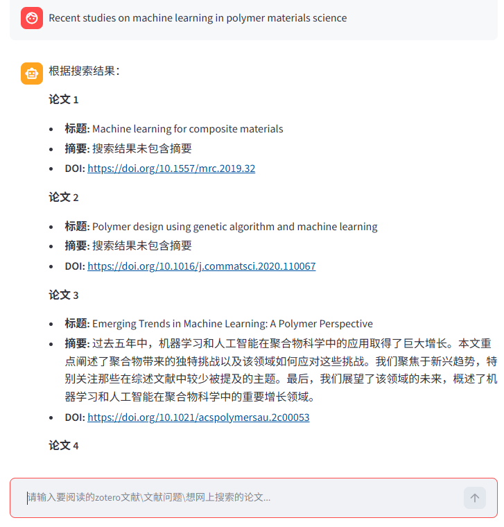

# Zotero Literature Reader Agent

Academic literature reading and review assistant based on Zotero, RAG, and Large Language Models.

## Features

- Search papers from a local Zotero library
- Automatically open Zotero PDF attachments
- RAG-based paper question answering
- Online literature search and review generation
- Streamlit web interface
- Conversation memory for paper discussion

## Requirements
- Python 3.8–3.12
- Zotero installed
- Papers imported into Zotero with PDF attachments

## Installation
git clone https://github.com/mohuyue/Literature-Agent.git

cd Literature-Agent

pip install -r requirements.txt

## Configuration

Create .env file in the project root directory.

Here is an example in .env.example：

    # LLM Configuration: API_KEY, Base URL and model name of your LLM provider.
 
    LLM_API_KEY = YOUR_API_KEY 
    LLM_BASE_URL = https://api.siliconflow.cn/v1
    LLM_MODEL = deepseek-ai/DeepSeek-V4-Pro

    # Zotero Configuration, your zotero file path

    ZOTERO_DB_PATH = ****\storage\zotero.sqlite
    ZOTERO_STORAGE_PATH = ****\storage

    # Literature Search tool base url

    Literature_Search_BASE_URL = https://api.openalex.org/works

Zotero Paths

Locate your Zotero data directory:
Open Zotero
Edit → Preferences → Advanced → Files and Folders
Check the Data Directory Location

Example:
C:\Users\YourName\Zotero
Then set:
ZOTERO_DB_PATH=C:\Users\YourName\Zotero\zotero.sqlite
ZOTERO_STORAGE_PATH=C:\Users\YourName\Zotero\storage

## Important

⚠️ Before running the application, please close Zotero completely.

This project directly reads data from the Zotero SQLite database (zotero.sqlite).

If Zotero is running, the database may be locked, resulting in errors such as:

database is locked
sqlite3.OperationalError

## Run

streamlit run app.py

## Usage
### Read a paper from Zotero

Example:

阅读zotero文章
Machine Learning-Driven Prediction of Polypropylene Alloy Properties

### Ask questions about the paper

Examples:

Summarize this paper

### Generate a literature review

Examples:
The agent will search online literature and generate a review summary.
Recent studies on machine learning in polymer materials science

